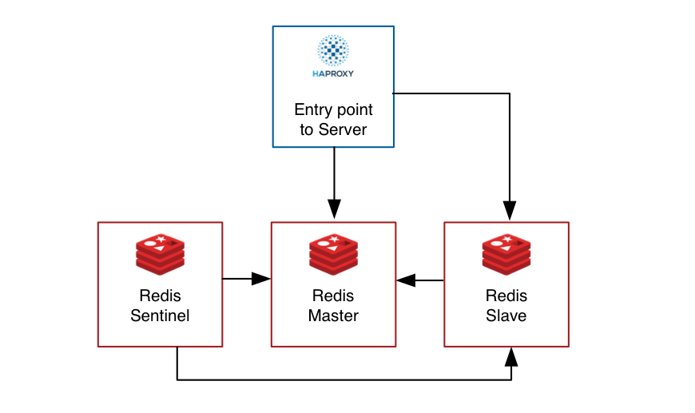

# Redis cluster

**Duktig Microservices** - Intermediate Data Center Docker containers, based on Redis cluster with sentinel, haproxy load balancer

## Version 1.0.0



- Cache
- Pub/Sub
- Set/Get
- Message/Queue

## Features

- **Persistence:** Redis setup supported to run in persistence mode with host shared volume to avoid database loss after crash or restart.
- **Single Address and port:** In your applications from other containers you have to access to only one host and port.
- **Hight availability:** With help of Redis Sentinel, the Server provides Hight availability even master server stops functioning.

## Structure

- **HAProxy:** Proxy server to server one connection to Redis
- **Redis Master:** Main Redis master server
- **Redis Slave:** Slave for Redis server 
- **Redis Sentinel:** Supports Redis server availability

When a Redis master downs, the slave will become a master and support functionality as before.

This Microservice supports one `host:port` access to clients.

See docker-compose.yml for details.

## Deployment

Do Deploy the microservice just enter to directory and run:

    $ docker-compose up -d

And you will see running containers finally:

    $ docker-compose ps

```
                  Name                                 Command               State                       Ports
-----------------------------------------------------------------------------------------------------------------------------------
intermediate_data_center_haproxy_1          /haproxy-entrypoint.sh hap ...   Up      0.0.0.0:6379->6379/tcp, 0.0.0.0:9000->9000/tcp
intermediate_data_center_redis_master_1     master-entrypoint.sh             Up      6379/tcp
intermediate_data_center_redis_sentinel_1   sentinel-entrypoint.sh           Up      26379/tcp, 6379/tcp
intermediate_data_center_redis_slave_1      slave-entrypoint.sh              Up      6379/tcp
```

After Docker compose deployment you can scale containers like:

    $ docker-compose up --detach --scale redis_mater=3 --scale redis_slave=3 --scale redis_sentinel=3
    
As you see, there are 3 containers for each instance

## Environment Variables

The following environment variables are supported for this setup: 

### Redis Master

- REDIS_PORT=6379
- REDIS_PASSWORD=re2020Duk_psGw
- REDIS_DB_FILE_PREFIX=master
- REDIS_MASTER_PASSWORD=re2020Duk_psGw

### Redis Slave

- REDIS_PORT=6379
- REDIS_PASSWORD=re2020Duk_psGw
- REDIS_MASTER_PASSWORD=re2020Duk_psGw
- REDIS_DB_FILE_PREFIX=slave
- REDIS_REPLICAOF_HOST=redis_master
- REDIS_REPLICAOF_PORT=6379

### Redis Sentinel

- SENTINEL_DOWN_AFTER=5000
- SENTINEL_FAILOVER=5000
- SENTINEL_QUORUM=1
- REDIS_MASTER_HOST=redis_master
- REDIS_MASTER_PORT=6379
- REDIS_PASSWORD=re2020Duk_psGw

### HAProxy

- ADMIN_USERNAME=admin
- ADMIN_PASSWORD=password
- REDIS_HOSTS=redis_master,redis_slave
- REDIS_PASSWORD=re2020Duk_psGw

## Todo

- More functionality with sentinel to analyse the health

## HAProxy access

    http://10.211.55.8:9000/haproxy_stats

    admin / password
    
## Sentinel Analyzes

Get the sentinel information with following commands:

    $ docker-compose exec redis_sentinel redis-cli -p 26379 -a re2020Duk_psGw info Sentinel

```
# Sentinel
sentinel_masters:1
sentinel_tilt:0
sentinel_running_scripts:0
sentinel_scripts_queue_length:0
sentinel_simulate_failure_flags:0
master0:name=mymaster,status=ok,address=172.23.0.3:6379,slaves=1,sentinels=1
```
    $ docker-compose exec redis_sentinel redis-cli -p 26379 -a re2020Duk_psGw SENTINEL get-master-addr-by-name mymaster

```
1) "172.23.0.3"
2) "6379"
```

    $ docker-compose exec redis_sentinel redis-cli -p 26379 -a re2020Duk_psGw SENTINEL replicas mymaster

```
1)  1) "name"
    2) "172.23.0.2:6379"
    3) "ip"
    4) "172.23.0.2"
    5) "port"
    6) "6379"
    7) "runid"
    8) "bc29925cc14ef2439477ec3be321c2a147f73b07"
    9) "flags"
   10) "slave"
   11) "link-pending-commands"
   12) "0"
   13) "link-refcount"
   14) "1"
   15) "last-ping-sent"
   16) "0"
   17) "last-ok-ping-reply"
   18) "301"
   19) "last-ping-reply"
   20) "301"
   21) "down-after-milliseconds"
   22) "5000"
   23) "info-refresh"
   24) "2398"
   25) "role-reported"
   26) "slave"
   27) "role-reported-time"
   28) "1016397"
   29) "master-link-down-time"
   30) "0"
   31) "master-link-status"
   32) "ok"
   33) "master-host"
   34) "172.23.0.3"
   35) "master-port"
   36) "6379"
   37) "slave-priority"
   38) "100"
   39) "slave-repl-offset"
   40) "314505"
```

## Testing Redis sentinel 

You can do the test manually to pause/unpause redis server through

    $ docker-compose pause redis_master
    $ docker-compose unpause redis_master

## Legal usage

This software/schema is a part of **Duktig Microservices** Package developed by **Duktig Solutions LLC**

**Copyright 2021 Duktig Solutions LLC**

## Contacts

- Email: software@duktig.dev>
- Phone: +37495565003
- Website: http://duktig.solutions

End of document
